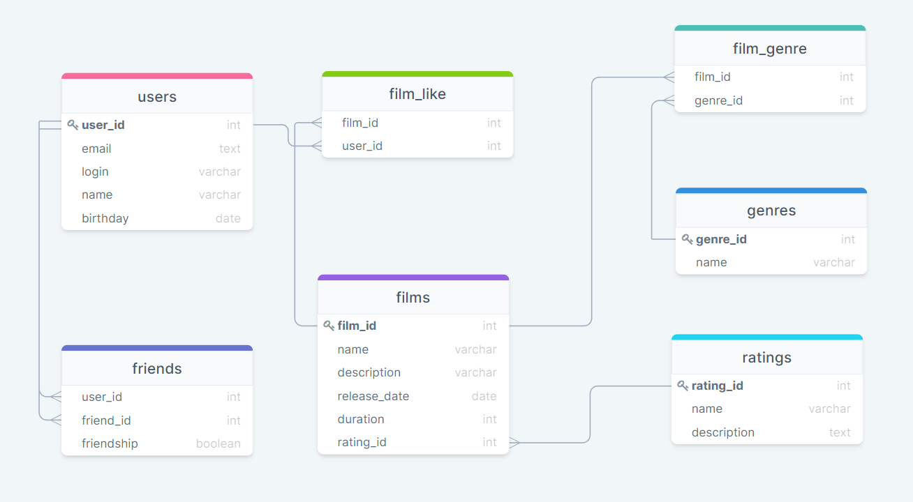

# java-filmorate
Template repository for Filmorate project.

В проекте реализованы классы Film и User, а также созданы 
FilmController и UserController для работы с приложением
с помощью GET, POST и PUT запросов. Также создано 
собственное исключение ValidationException, которое 
используется при валидации данных.

В проект добавлены сервисы UserService и FilmService, а также
реализованы хранилища и интерфейсы к ним. Создано новое исключение
NotFoundException и контроллер ErrorHandler, который отвечает
за обработку статус-кода исключений.

Хранилища реализованы с помощью базы данных H2, в них реализована
вся CRUD-логика.

## ER-диаграмма



### Основные запросы:

Вывов всех пользователей
````
SELECT * FROM users;
````
Вывод всех фильмов
````
SELECT * FROM films;
````
Вывести топ-10 популярных фильмов
````
SELECT films.name 
FROM films 
INNER JOIN film_like ON films.film_id = film_like.film_id
GROUP BY films.name
ORDER BY COUNT(film_like.film_id) DESC
LIMIT 10;
````
Вывести список общих друзей
````
SELECT users.name
FROM users
INNER JOIN friends ON users.user_id = friends.user_id
WHERE user_id = 1
AND friend_id IN (
    SELECT friend_id 
    FROM friends 
    WHERE user_id = 2
    AND friends.friendship IS TRUE
)
AND friends.friendship IS TRUE;
````